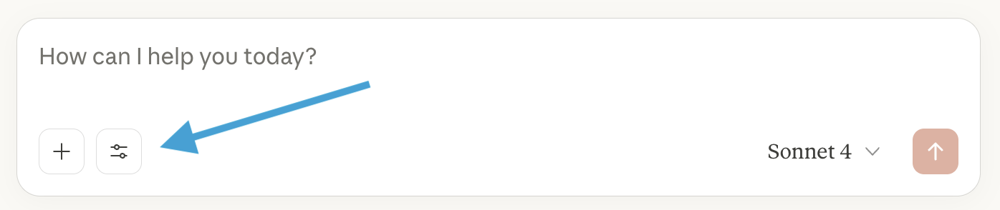
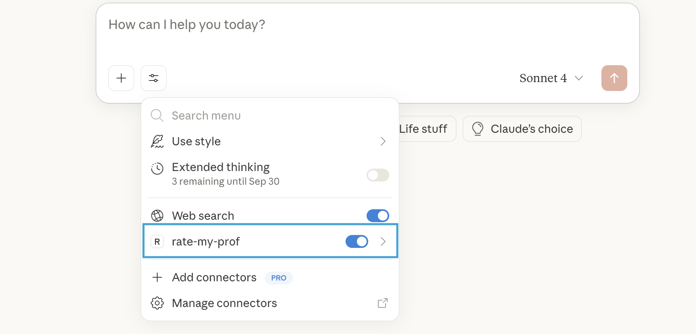

# RateMyProfessors MCP Server


An _unofficial_ [MCP Server](https://modelcontextprotocol.io/docs/getting-started/intro) implementation for [RateMyProfessors.com](https://www.ratemyprofessors.com/).  
It allows you to fetch a professor's ratings, reviews and comments with an MCP client.

## Features

- Search for professors by **name** and **school**.
- Get **ratings**, **reviews**, and **comments**.
- Easy integration with MCP clients like (Claude Desktop, VSCode, etc.).

## Requirements

- Node.js 16 or newer ([install node](https://nodejs.org/en) if you haven't)
- Claude Desktop or any other MCP client

## Installation

Clone the repository and install dependencies:

```bash
git clone https://github.com/tohmze/ratemyprofessors-mcp.git
cd ratemyprofessors-mcp
npm install
```

Build the server
```bash
npm run build 
```

## Testing the MCP Server with Claude Desktop

### Setup Claude Desktop Config file

To use the ratemyprofessors MCP server, you’ll need to set it up in Claude for Desktop. Open the configuration file located at ```~/Library/Application Support/Claude/claude_desktop_config.json``` with a text editor. **If the file isn’t there yet, go ahead and create it.**

If you have VSCode, Open with:

- Mac: ```code ~/Library/Application\ Support/Claude/claude_desktop_config.json```
- Windows: ```code $env:AppData\Claude\claude_desktop_config.json```

Copy the appropriate configuration snippet for your OS below and replace the placeholder path with the absolute path to your build folder.
<details>
<summary>macOS / Linux</summary>

```json
{
  "mcpServers": {
    "rate-my-prof": {
      "command": "node",
      "args": ["/ABSOLUTE/PATH/TO/PARENT/FOLDER/ratemyprofessors-mcp/build/index.js"]
    }
  }
}
```
</details>

<details>
<summary>Windows</summary>

```json
{
  "mcpServers": {
    "rate-my-prof": {
      "command": "node",
      "args": ["C:\\PATH\\TO\\PARENT\\FOLDER\\ratemyprofessors-mcp\\build\\index.js"]
    }
  }
}
```
</details>

### Open Claude for Desktop
Click The Tool 


You should see the rate-my-prof tool listed


**Congrats 🥳 the server is ready to use!** 

## Demo
Demo of using the RateMyProf MCP server in Claude Desktop:


## Acknowledgements

This project uses the [rmp-ts-api](https://github.com/DeveloperMindset123/rmp-ts-api) Typescript Wrapper API by [@DeveloperMindset123](https://github.com/DeveloperMindset123). Big thanks for making it! 
